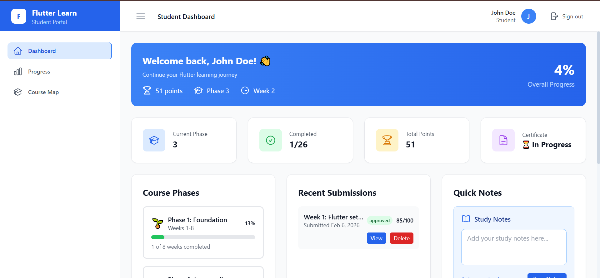
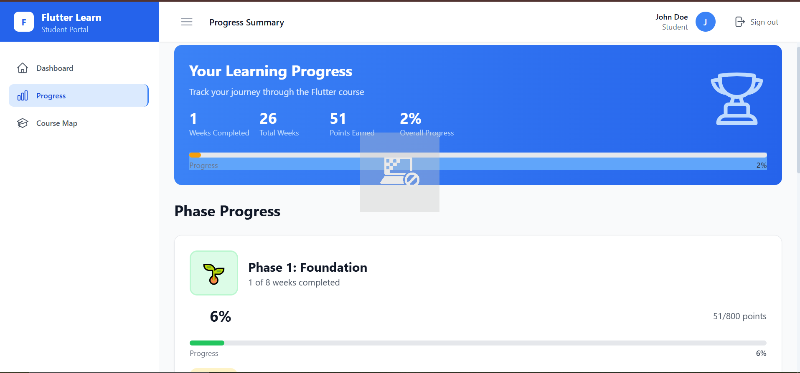
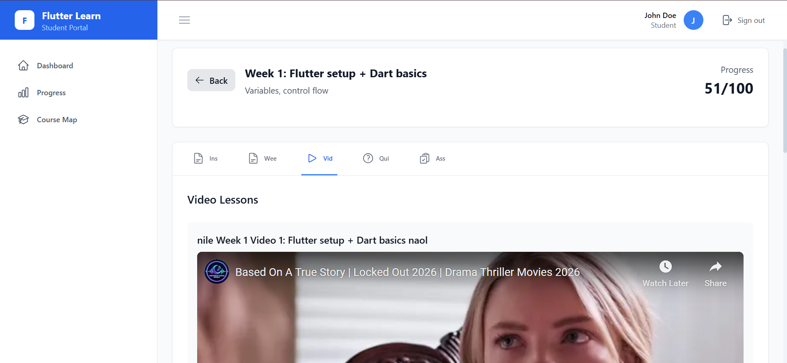
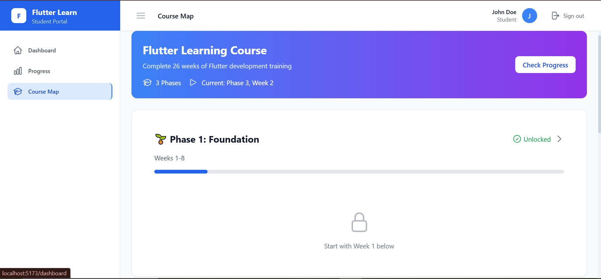
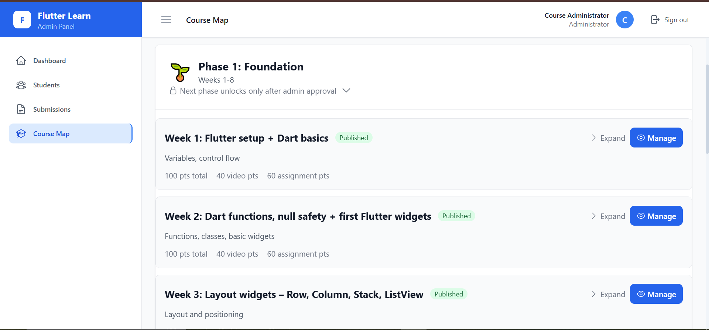

# Flutter Learning Platform

A comprehensive Learning Management System (LMS) for Flutter mobile development courses with responsive design and professional UI.

<div align="center">

[]
[]
[]
[
[

</div>

## 📁 Project Structure

```
flutter-learning-platform/
├── frontend/          # React Frontend (Vite + Tailwind CSS)
│   ├── src/
│   │   ├── components/    # Reusable UI components
│   │   ├── pages/        # Application pages
│   │   ├── services/     # API services
│   │   └── utils/        # Utility functions
│   ├── package.json
│   └── vite.config.js
├── backend/           # Node.js Backend (Express + MySQL)
│   ├── controllers/     # Route controllers
│   ├── middleware/      # Authentication & validation
│   ├── models/         # Database models
│   ├── routes/         # API routes
│   ├── services/       # Business logic
│   ├── utils/          # Helper functions
│   └── server.js       # Server configuration
├── start-app.js       # Application launcher
└── README.md
```

## 🚀 Quick Start

### Prerequisites

- Node.js (v14 or higher)
- MySQL (v8 or higher)
- npm or yarn

### 1. Install Dependencies

```bash
# Backend
cd backend
npm install

# Frontend (in new terminal)
cd frontend
npm install
```

### 2. Configure Database Connection

```bash
# The project comes with pre-configured database settings
# No changes needed if you're using the existing setup
# Database configuration in backend/.env:
DB_HOST=localhost
DB_USER=root
DB_PASS=root
DB_NAME=flutter_learning_platform

# Only update if you have different database credentials
cd backend
# Edit .env file only if needed
```

### 3. Database Setup

```bash
# Import the database schema
mysql -u root -p flutter_learning_platform < backend/database_setup.sql
```

### 4. Start Both Servers

```bash
# From root directory (recommended)
node start-app.js
```

Or start them separately:

```bash
# Terminal 1 - Backend
cd backend
npm run dev

# Terminal 2 - Frontend
cd frontend
npm run dev
```

### 5. Access the Application

- **Frontend**: http://localhost:5173
- **Backend API**: http://localhost:5000/api

### 6. Default Login Credentials

- **Admin**: admin@example.com / admin123
- **Student**: student@example.com / student123

## 🎯 Features

### Student Portal

- 📊 **Progress Dashboard**: Visual phase and week tracking
- 🎥 **Video Lessons**: Embedded video content with progress tracking
- 📝 **Assignment System**: Upload and submit assignments
- 📈 **Progress Summary**: Detailed completion statistics
- 🏆 **Certificate Generation**: Automatic certificates upon completion
- 📱 **Fully Responsive**: Optimized for all screen sizes (320px+)

### Admin Portal

- 👥 **User Management**: Monitor and manage students
- ✅ **Assignment Review**: Grade and provide feedback
- 📚 **Content Management**: Update course materials
- 📊 **Analytics Dashboard**: Track student progress
- 🎨 **Professional UI**: Modern, responsive admin interface
- 📱 **Mobile Optimized**: Perfect tablet and mobile experience

### Course Structure

- **Phase 1**: Foundation (Weeks 1-8)
  - Dart programming fundamentals
  - Flutter widgets and layouts
  - Basic navigation and state
- **Phase 2**: Intermediate (Weeks 9-16)
  - State management solutions
  - API integration and networking
  - Advanced UI patterns
- **Phase 3**: Advanced (Weeks 17-26)
  - Testing and debugging
  - Deployment and publishing
  - Portfolio development

### Technical Features

- 🎨 **Responsive Design**: Mobile-first approach (320px to desktop)
- 🔐 **JWT Authentication**: Secure user sessions
- � **File Uploads**: Assignment submission system
- � **Real-time Progress**: Live tracking and updates
- � **Professional UI**: Modern design with Tailwind CSS
- ⚡ **Performance**: Optimized loading and interactions

## 🛠️ Development

### Frontend Technologies

- **React 18**: Modern component-based UI
- **Vite**: Fast development server and build tool
- **Tailwind CSS**: Utility-first CSS framework
- **React Router**: Client-side routing
- **Axios**: HTTP client for API calls

### Backend Technologies

- **Node.js**: JavaScript runtime
- **Express.js**: Web framework
- **MySQL**: Relational database
- **JWT**: Authentication tokens
- **Multer**: File upload handling
- **bcrypt**: Password hashing

### API Endpoints

```
Authentication:
POST /api/auth/login
POST /api/auth/register
POST /api/auth/verify-email

Student:
GET /api/student/dashboard
GET /api/student/progress
POST /api/student/submit-assignment

Admin:
GET /api/admin/dashboard
GET /api/admin/students
GET /api/admin/submissions
POST /api/admin/review-submission
```

## 🔧 Troubleshooting

### Database Connection Issues

1. Ensure MySQL service is running
2. Verify credentials in `backend/.env`
3. Test connection: `cd backend && node -e "require('./config/database').query('SELECT 1')"`
4. Check if database exists: `mysql -u root -p -e "SHOW DATABASES;"`

### Port Conflicts

- Backend uses port 5000
- Frontend uses port 5173
- Kill processes: `netstat -ano | findstr :5000` then `taskkill /PID <PID> /F`

### Common Issues

- **CORS errors**: Backend must be running for frontend to work
- **Module not found**: Run `npm install` in both directories
- **Database errors**: Check MySQL service and credentials

## 📱 Responsive Design

This application is fully responsive with professional optimization:
- **Mobile (320px+)**: Touch-optimized interface
- **Tablet (768px+)**: Enhanced readability and interactions
- **Desktop (1024px+)**: Professional desktop experience
- **Large Screens (1440px+)**: Optimized for high-resolution displays

## 🚀 GitHub Deployment

### Prerequisites for GitHub
- Node.js (v14 or higher)
- MySQL (v8 or higher)
- Git

### 1. Clone and Setup
```bash
git clone <repository-url>
cd flutter-learning-platform
```

### 2. Install Dependencies
```bash
# Backend
cd backend
npm install

# Frontend (in new terminal)
cd frontend
npm install
```

### 3. Environment Configuration
```bash
# Backend - Copy existing environment (no changes needed)
cd backend
cp .env.example .env
# Database is pre-configured with your existing settings:
# - DB_HOST=localhost
# - DB_USER=root  
# - DB_PASS=root
# - DB_NAME=flutter_learning_platform
# Only update if you need different credentials

# Frontend - Copy environment
cd ../frontend
cp .env.example .env
# Edit .env if needed for production API URL
```

### 4. Database Setup
```bash
# Import the database schema
mysql -u root -p flutter_learning_platform < backend/database_setup.sql
```

### 5. Start Development Servers
```bash
# From root directory
node start-app.js
```

### 6. Production Deployment
```bash
# Build frontend for production
cd frontend
npm run build

# Start backend in production mode
cd ../backend
NODE_ENV=production npm start
```

### Environment Variables
```bash
# Backend .env (Pre-configured with your existing settings)
DB_HOST=localhost
DB_USER=root
DB_PASS=root
DB_NAME=flutter_learning_platform
JWT_SECRET=flutter_learning_platform_super_secret_key_2024_make_it_very_long_and_secure
JWT_REFRESH_SECRET=flutter_learning_platform_refresh_secret_2024_also_very_long_and_secure
PORT=5000
NODE_ENV=development

# Frontend .env (Optional)
VITE_API_URL=http://localhost:5000/api
VITE_APP_NAME=Flutter Learning Platform
VITE_APP_VERSION=1.0.0
```

### Security Notes
- **Never commit .env files** - They are included in .gitignore
- **Use strong JWT secrets** - Minimum 32 characters recommended
- **Update email credentials** - Use app-specific passwords for Gmail
- **Database security** - Use strong MySQL passwords in production

### Git Configuration
```bash
# Initialize git repository
git init
git add .
git commit -m "Initial commit: Flutter Learning Platform"

# Add remote and push
git remote add origin <your-github-repository-url>
git push -u origin main
```

## 📄 License

MIT License - Free for commercial and personal use

## 🤝 Contributing

1. Fork the repository
2. Create a feature branch
3. Make your changes
4. Test thoroughly
5. Submit a pull request

---

**Built with ❤️ for Flutter education**
